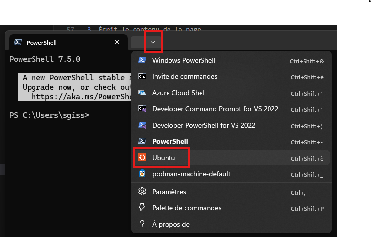
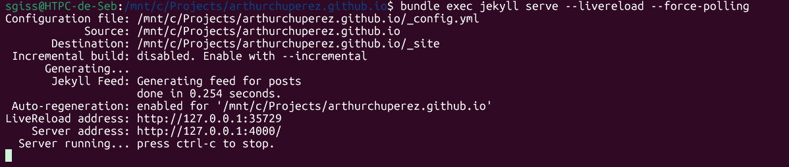

# Introduction

Ce site [GitHub Pages](https://docs.github.com/en/pages/getting-started-with-github-pages/creating-a-github-pages-site) utilise le générateur de site [Jekyll](https://docs.github.com/en/pages/setting-up-a-github-pages-site-with-jekyll/about-github-pages-and-jekyll) qui permet de générer un site statique HTML grâce au langage de template [Liquid](https://shopify.github.io/liquid/).

[Liquid API and references](https://shopify.dev/docs/api/liquid).

# Architecture du code

## Les modèles

Le dossier `_layouts` contient les modèles utilisés dans les pages du site.

Exemple de modèle

```html
<!DOCTYPE html>
<html lang="fr">
    <head>
        <meta charset="UTF-8">
        <title>...</title>
        <link rel="stylesheet" href="static/style.css">
        <script src="static/script.js"></script>
    </head>

    <body>
        ...

        {{ content }}
        
        ...
    </body>
</html>
```

La balise `{{ content }}` permet d'indiquer où insérer le contenu de la page en cours de compilation.

## Les pages

Pour qu'une page utilise un modèle, il faut l'indiquer en premier dans la page comme ceci.

```
---
layout: default
---
```


Ici, Jekyll comprend alors qu'il doit aller chercher le fichier `_layouts/default.html`


# Compilation d'une page

Lorsque Jekyll compile la page, il :
1. Lit le modèle `_layouts/default.html`
2. Écrit le début du modèle jusqu'à la balise `{{ content }}`
3. Écrit le contenu de la page
4. Écrit la fin du modèle qui est après la balise `{{ content }}`

## Exemple de compilation

Prenons l'exemple de modèle ci-dessus pour l'utiliser avec cette page.

```html
---
layout: default
---
<section id="contact">
    <h2>Contactez-moi</h2>
    <p class="intro">Je suis ouvert à toute opportunité de stage, question ou collaboration.<br/>N'hésitez pas à me contacter !</p>
</section>
```

Le résultat de la compilation sera ceci.

```html
<!DOCTYPE html>
<html lang="fr">
    <head>
        <meta charset="UTF-8">
        <title>...</title>
        <link rel="stylesheet" href="static/style.css">
        <script src="static/script.js"></script>
    </head>

    <body>
        ...

        <section id="contact">
            <h2>Contactez-moi</h2>
            <p class="intro">Je suis ouvert à toute opportunité de stage, question ou collaboration.<br/>N'hésitez pas à me contacter !</p>
        </section>
        
        ...
    </body>
</html>
```


# Setup local

## Installer WSL

Ouvrir le `Terminal` Windows et installer WSL qui permet d'avoir un environnement Linux sous Windows.

Cela installera Ubuntu par défaut. Redémarrer le PC si nécessaire.

```cmd
wsl --install
```

## Installer Ruby dans Ubuntu

Ouvrir Ubuntu dans le `Terminal` Windows.



Installer les composants Ruby qui permettent de lancer Jekyll.

```bash
sudo apt update
sudo apt install -y ruby-full build-essential zlib1g-dev
```

Ouvrir le fichier `~/.bashrc` avec l'éditeur de texte `nano` pour le modifier.

```bash
nano ~/.bashrc
```

Coller les lignes suivantes à la fin du fichier.

```
export GEM_HOME="$HOME/gems"
export PATH="$HOME/gems/bin:$PATH"
```

Sauvegarder et quitter en faisant `CTRL+X`.

Recharger le fichier

```bash
source ~/.bashrc
```

## Installer et lancer Jekyll dans Ubuntu

```bash
gem install jekyll bundler
```

Dans Ubuntu, le lecteur `C:\` est accessible depuis le dossier `/mnt/c`.

Se placer dans le dossier du projet, par exemple.

```bash
cd /mnt/c/Projects/arthurchuperez.github.io
```

Lancer Jekkyll

```bash
bundle exec jekyll serve --livereload --force-polling
```



Le site est alors accessible à l'adresse [http://127.0.0.1:4000](http://127.0.0.1:4000) et devrait être compilé à la volée à chaque changement de fichier.

Parfois il faut forcer le rafraîchissement avec F5.
